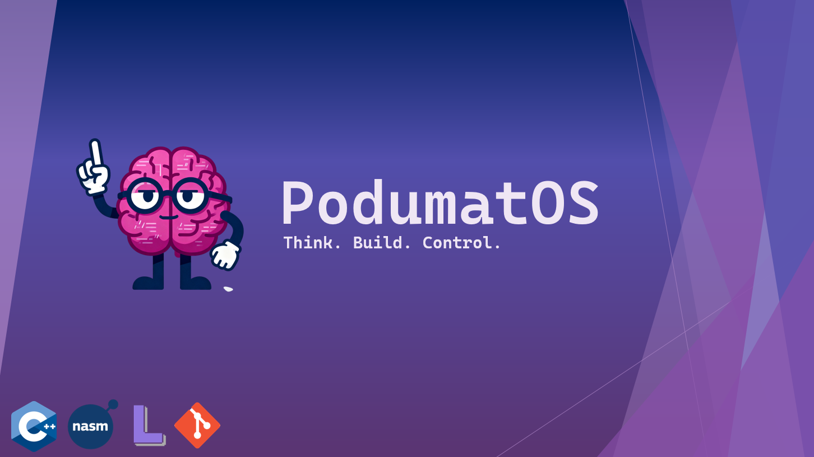
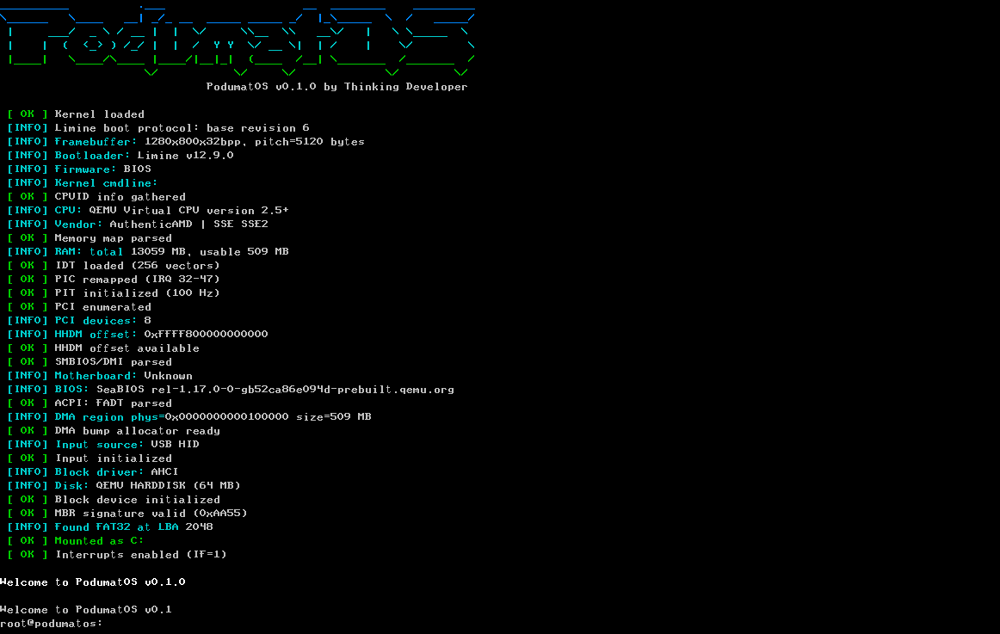
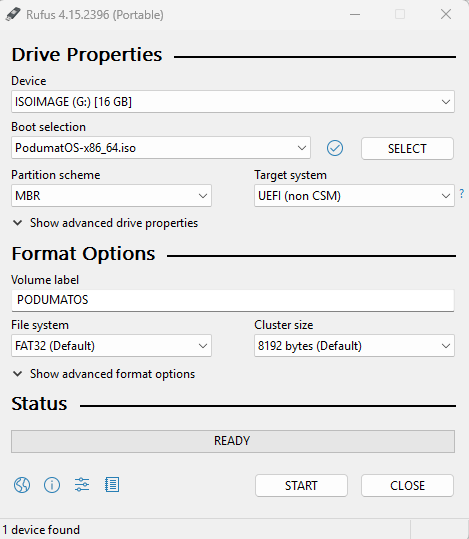

<div align="center">
  <p align="center">
    
  </p>

  <br>
  <h1>PodumatOS</h1>
  <h4>A customizable hobby OS for x86_64. Written from scratch in C++ and NASM. Booted by Limine. Built for transparency and simplicity.</h4>


  <p align="center">
    
  </p>
</div>

<br>

> [!NOTE]
> ## You can view the documentation [here](https://github.com/PodumatOS/Docs). By using this operating system, you agree to the [EULA](https://github.com/PodumatOS/PodumatOS/blob/main/EULA.txt).

## What was this operating system created for?
**PodumatOS** is designed for specific goals:

- **Complete system customization.** During installation, you choose exactly which components to include – from drivers to the package manager itself. Want to disable Bluetooth entirely? Don't install it. Prefer git over our package manager? Build the system without it. You control what runs on your machine.
- **Learning.** Licensed under BSD-2-Clause, PodumatOS code is free to study, adapt, and reuse – even in your own projects. Read the source, borrow ideas, fork the kernel, or use individual drivers in your own OS. You don't need permission; the license already grants it.
- **Legacy hardware.** Built for older machines. PodumatOS falls back gracefully: if there is no AHCI, it uses ATA PIO. If there is no USB, it uses PS/2. Minimum requirements are low – a Pentium or later with a few hundred MB of RAM is enough.
- **Transparency and control.** No telemetry. No phoning home. No hidden processes. Every line of code is open and auditable – you can read it, understand it, and verify that it does exactly what it claims. All system events are logged to the serial console (COM1), visible from boot to shutdown.
- **Built by enthusiasts, for enthusiasts.** PodumatOS is an open project, and contributions are welcome. Whether you want to write drivers, improve the shell, add filesystem support, or just report a bug – your help is appreciated. Check the [CONTRIBUTING.md](CONTRIBUTING.md) guide to get started.

## Drivers
### Drivers List

| Drivers | Notes |
|------|-------|
| **AHCI** | Disk partitioning, reading/writing SATA controller |
| **ATA PIO** | Disk partitioning, reading/writing Legacy ATA Controller |
| **PS/2** | PS/2 keyboard input. |
| **EHCI (USB 2.0)** | USB 2.0 host controller + USB HID keyboard. |
| **FAT32** | Read/write files, create/delete directories, format. |
| **MBR** | MBR partition table. Create, delete, list partitions. |
| **PCI** | PCI bus enumeration and device discovery. |
| **DMA** | DMA-capable memory allocator for device drivers. |

### Drivers in development/coming soon

| Drivers | Notes |
|------|-------|
| **xHCI** | USB 3.0 host controller. |
| **AHCI NCQ** | Native Command Queuing. Up to 32 queued ATA commands |
| **NVMe** | Disk partitioning, reading/writing NVMe controller |
| **ext2** | ext2 filesystem for OS installation. |
| **e1000** | Intel 82540EM network driver (QEMU) |
| **RTL8169** | Realtek RTL8111/8168 network driver |
| **I225-V** | Intel I225/I226 2.5 Gbps network driver |
| **USB/PS2 Mouse** | Mouse Input |
| **ISO 9660** | CD/DVD filesystem |

## Kernel
### Kernel Components

| Component | Description |
|-----------|-------------|
| **IDT** | Interrupt Descriptor Table |
| **ISR** | Interrupt Service Routines (assembly stubs) |
| **PIC** | 8259 Programmable Interrupt Controller |
| **PIT** | Programmable Interval Timer (100 Hz) |
| **DMA** | DMA memory allocator |
| **Console** | Framebuffer text console |
| **Shell** | Interactive |

## Screenshots

<p align="center">
  
  <br><em>Screenshot PodumShell</em>
</p>

## Requirements

- make
- gcc
- g++
- ld
- objcopy
- nasm
- xorriso
- mtools
- sgdisk
- curl
- git
- tar
- gunzip
- bash
- qemu-system-x86_64
- qemu-img

## 📥 How to install an OS?

### **Method 1: Download from releases**
1. Download `PodumatOS-x86_64.iso` from [Releases](https://github.com/PodumatOS/PodumatOS/releases).
2. Create a **bootable USB drive** using **UltraISO, Rufus, etc**. Build it as an ISO image, not DD.
  <p align="center">
    
    <br><em>Configuration example</em>
  </p>
3. Depending on your motherboard, boot from the USB flash drive.

### **Method 2: Pack it yourself**
1. Download the entire source archive from this repository.
2. Install the necessary dependencies listed above.
3. Enter the commands below (for example, in **MSYS UCRT64**):
```bash
./build.sh clean
./build.sh build
```
4. You can also turn the flash drive into a bootable one (rufus) or launch it in **QEMU**:
```bash
./start.sh
```

## 📜 License
**BSD 2-Clause License**

**Copyright (c) 2026, Thinking Developer**
